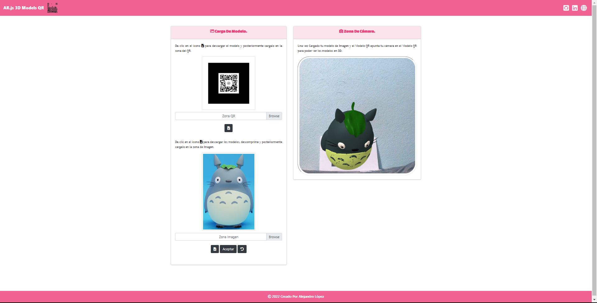

# <h1 align="center" style="color: #d81b60;"> AR.js 3D Models QR 👨🏻‍💻 </h1> 
  

`A-Frame` is a web framework for building virtual reality (VR) experiences. A-Frame is based on top of HTML, making it simple to get started. But `A-Frame` is not just a 3D scene graph or a markup language; the core is a powerful entity-component framework that provides a declarative, extensible, and composable structure to` three.js`.      

This web application will allow you to view some 3D models through Augmented Reality (AR), with the `A-Frame` framework and the `AR.js` framework. Implemented with a QR type marker generated through the `AR.js Studio`
  

## 
 Requirements 

- [HTML5](https://developer.mozilla.org/es/docs/Web/HTML) 
- [CSS3](https://developer.mozilla.org/es/docs/Web/CSS)
- [JavaScript](https://developer.mozilla.org/es/docs/Web/JavaScript)

## 
 References 

- [A-Frame](https://aframe.io/)
- [AR.js](https://github.com/jeromeetienne/AR.js)  
- [AR.js Studio](https://ar-js-org.github.io/studio/pages/marker/index.html)  

  

## 
 Screenshot Project 💻 

🔶 [Project Website](https://alejandro-lopez.futuretecware.com/AR.js-3D-Models-QR/index.html)

